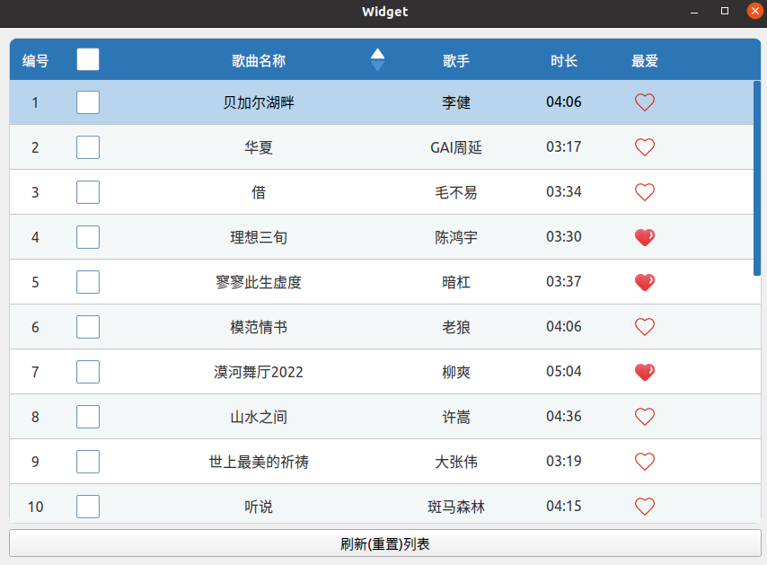
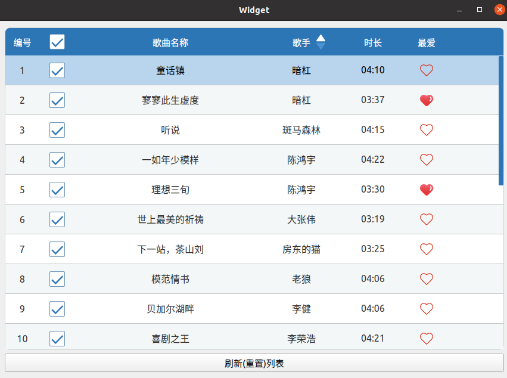

# BaseTable
该项目提供一个建立在QTableWidget类上的基础表格组件，封装了一些常用功能方便使用。同时使用该组件设计了一个小demo，展示了常见表格控件的设计流程与方法。  
## 功能概述：
* 该项目的核心组件是BaseTableWidget，继承自QTableWidget，适用于数据量不太大的表格部件显示，使用起来比较方便。而如果表格所承载的数据量比较巨大则可以使用QTableView，采用MVC框架实现。  
* BaseTableWidget内部封装了一些常用接口，方便设置/获取表格数据，同时提供了垂直滚动条悬浮的功能接口，主要针对早期Qt版本的触摸程序设计，加宽滚动条方便滑动，而看起来又没那么糟。  
* 该项目还为BaseTableWidget提供一个辅助头文件basetablestyle.h，内部定义了一些样式宏(带有参数解析)，可以参考实现各式各样的表格外观。
* 如有对表头设计控件的需求，可与提供的CustomHeaderView类配合使用。
## 接口函数：
```
    /*设置/获取单元格数据(文本、图标、部件以及用户自定义数据等)*/
    void setItemText(int row, int column, QString text, int alignment=Qt::AlignCenter);
    QString getItemText(int row,int column);
    void setItemIcon(int row, int column, QIcon &icon);
    void setItemWidget(int row,int column,QWidget *widget,bool isCenteredLayout=false);
    QWidget *getItemWidget(int row,int column,bool isCenteredLayout=false);
    void setItemData(int row,int column,QVariant variant,int role=Qt::UserRole);
    QVariant getItemData(int row,int column,int role=Qt::UserRole);

    /*其他常用功能接口*/
    void setColumnAutoNumber(int column,int firstNumber=1);//设置某列自动编号
    void setColWidthRowHeight(int columnWidth,int rowHeight);//设置列宽行高
    //设置表格垂直滚动条悬浮显示
    void setVerScrollBarSuspension(int verScrollBarActualWidth=56,
                                   int verScrollBarVisibleWidth=9,
                                   bool verScrollBarAsNeeded=false);
```
## 项目例程：
该项目除了上面提到的BaseTableWidget以及相关基础组件外，还提供了委托类SongsTableDelegate用来自定义表格外观渲染以及BasetableDelegate展示委托类的编码流程，widget类则提供了一整套常见表格功能的设计方法。  
例程设计了一个歌曲列表，使用basetablestyles.h中提供的默认样式绘制表格外观，通过委托类绘制复选框和图标，并关联表格的cellClicked信号完成其交互个功能。使用CustomHeaderView自定义表头，添加复选框控件，并为表头了排序功能。表格数据来源于"./test/songs.txt"文件，运行时只需将test目录放到程序文件的同级目录下即可。  



## 作者联系方式:
**邮箱:justdoit_mqr@163.com**  
**新浪微博:@为-何-而来**  
